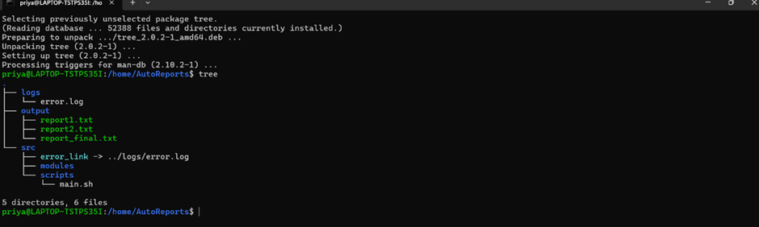

# Linux
Contains Linux shell commands and details 

## git
*   go to the repository folder
*   open terminal and type wsl
*   To open vs code use this below command
*   code .
*   vs code opens here
*   edit the readme file
*   save the changes in readme file
*   git add .
*   git commit -m "our message here"
*   git push
* 
## Change Directory cd 
### cd -
* This command will go back to the previous directory path

*Example*
```
priya@LAPTOP-TSTPS35I:/mnt/d/Priyas git/data$ cd
priya@LAPTOP-TSTPS35I:~$ cd -
/mnt/d/Priyas git/data
priya@LAPTOP-TSTPS35I:/mnt/d/Priyas git/data$
```
### cd ..
* This command will go to the previous directory

*Example*

```
priya@LAPTOP-TSTPS35I:/mnt/d/Priyas git$ cd ..
priya@LAPTOP-TSTPS35I:/mnt/d$
```
## Project Setup – AutoReports

* You are a developer managing a project named AutoReports on a Linux system.
* You are currently located in your Downloads directory:
  /home/yourusername/Downloads
* This directory contains a mix of files.
### Tasks
* Create a new project folder named AutoReports in your home directory.
*Example*

```
priya@LAPTOP-TSTPS35I:/home$ sudo mkdir AutoReports
priya@LAPTOP-TSTPS35I:/home$ ls
AutoReports  priya
```
* Inside AutoReports, create the following folder structure using a single command:
    *	src/
    *	src/scripts/
    *	src/modules/
    *	output/
    *	logs/
*Example*

```
priya@LAPTOP-TSTPS35I:/home$ cd AutoReports/
priya@LAPTOP-TSTPS35I:/home/AutoReports$ sudo mkdir -p src/scripts src/modules output logs
priya@LAPTOP-TSTPS35I:/home/AutoReports$ ls
logs  output  src
priya@LAPTOP-TSTPS35I:/home/AutoReports$ cd src
priya@LAPTOP-TSTPS35I:/home/AutoReports/src$ ls
modules  scripts
```
* In the Downloads directory, there are three files:
    * report1.txt
    * report2.txt
    * report_final.txt
    * Move only the files that start with report and end with .txt to the AutoReports/output/ directory.
*Example*

```
priya@LAPTOP-TSTPS35I:/mnt/c/Users/LOGAPRIYA$ cd Downloads/
priya@LAPTOP-TSTPS35I:/mnt/c/Users/LOGAPRIYA/Downloads$ touch report1.txt report2.txt report_final.txt
priya@LAPTOP-TSTPS35I:/mnt/c/Users/LOGAPRIYA/Downloads$ ls

priya@LAPTOP-TSTPS35I:/home/AutoReports$ sudo mv /mnt/c/Users/LOGAPRIYA/Downloads/report*.txt ./output/
priya@LAPTOP-TSTPS35I:/home/AutoReports$ ls
logs  output  src
priya@LAPTOP-TSTPS35I:/home/AutoReports$ cd output
priya@LAPTOP-TSTPS35I:/home/AutoReports/output$ ls
report1.txt  report2.txt  report_final.txt
```
* Inside src/scripts, create a blank file named main.sh and make it executable.
*Example*

```
priya@LAPTOP-TSTPS35I:/home/AutoReports/src/scripts$ sudo touch main.sh
priya@LAPTOP-TSTPS35I:/home/AutoReports/src/scripts$ ls
main.sh
```
* In the logs directory:
    * Create a file named error.log.
    * Then, create a symbolic link to error.log inside the src/ directory.
*Example*

```
priya@LAPTOP-TSTPS35I:/home/AutoReports$ sudo touch ./logs/error.log
priya@LAPTOP-TSTPS35I:/home/AutoReports$ ls
logs  output  src
priya@LAPTOP-TSTPS35I:/home/AutoReports$ cd logs
priya@LAPTOP-TSTPS35I:/home/AutoReports/logs$ ls
error.log

priya@LAPTOP-TSTPS35I:/home/AutoReports/logs$ cd ..
priya@LAPTOP-TSTPS35I:/home/AutoReports$ ls
logs  output  src
priya@LAPTOP-TSTPS35I:/home/AutoReports$ cd src
priya@LAPTOP-TSTPS35I:/home/AutoReports/src$  sudo ln -s ../logs/error.log ./error_link
priya@LAPTOP-TSTPS35I:/home/AutoReports/src$ ls
error_link  modules  scripts

```
* Remove the entire modules directory only if it exists and is empty.
*Example*

```
priya@LAPTOP-TSTPS35I:/home$ ls
AutoReports  priya
priya@LAPTOP-TSTPS35I:/home$ cd AutoReports/
priya@LAPTOP-TSTPS35I:/home/AutoReports$ ls
logs  output  src
priya@LAPTOP-TSTPS35I:/home/AutoReports$ cd ..
priya@LAPTOP-TSTPS35I:/home$ sudo rmdir --ignore-fail-on-non-empty AutoReports/
priya@LAPTOP-TSTPS35I:/home$ ls
AutoReports  priya
priya@LAPTOP-TSTPS35I:/home$ cd AutoReports/
priya@LAPTOP-TSTPS35I:/home/AutoReports$ ls
logs  output  src

priya@LAPTOP-TSTPS35I:/home/AutoReports/src$ cd ../..
priya@LAPTOP-TSTPS35I:/home$ sudo rm -rf AutoReports
priya@LAPTOP-TSTPS35I:/home$ ls
priya

```
## Output of tree ~/AutoReports




